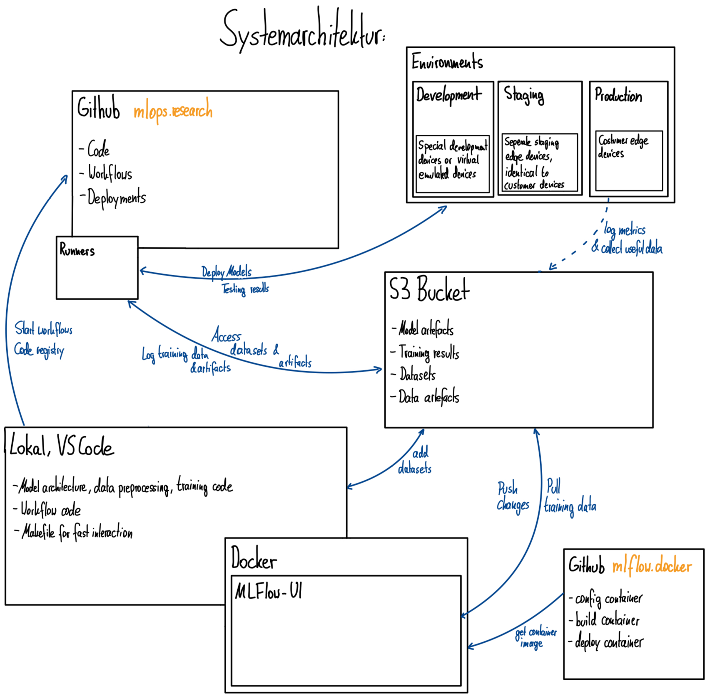

# Sandbox to implement MLOps practices

## How to start the mlflow ui

- Create a classic personal access token in your github developer settings (it only needs the read packages permission) and paste it to .env
- Add the aws key id and secrret and the bucket name to the .env file
- Run `make setup_mlflow_ui` to init and start the docker container
- Run `sync_mlflow_ui` to sync your local changes with the database, deletions of any kind are disabled
- Access the mlflow ui at [port 4444](http://localhost:4444)
- Run `make stop_mlflow_ui` to stop the docker container
- Run `make start_mlflow_ui` to start the container again
- Run make `remove_mlflow_ui` to delete the docker container and the image

## How to manage datasets

- Datasets are stored in the folder datasets. THe version control is handled by dvc. The datasets will be synced to github, but stored at another remote (default: s3)
- To download the dataset files, run `make dvc_pull_s3`
- To upload a new dataset file or sync changes, run `make dvc_comit_push_s3` and commit changes to github

## How to deploy a model

- Your github token must be configured to allow repo and workflow access
- Run `make start_dev_deployment_workflow`to start the workflow (no protection rules)
- Run `make start_prod_deployment_workflow`to start the workflow (approval required, deployment is only allowed from `main`)
- Check the workflow status in github actions

### How to configure a new environment

- Open the environment configuration
- Click `New Environment`
- Enter a name (lower key preferred)
- Configure potection rules
- Set the environment secrets `AWS_ACCESS_KEY_ID` and `AWS_SECRET_ACCESS_KEY`
- Set the environment variables `ÀWS_DEFAULT_REGION` and `BUCKET_NAME` to configure the S3 connection

## Next development steps

- Save more artifacts
- Advanced model training code with multiple parameters
- Deploy to an automated testing environment and run tests there
- Deploy to target system
- Export the model
- Run tests with the compiles model and the implementation code
