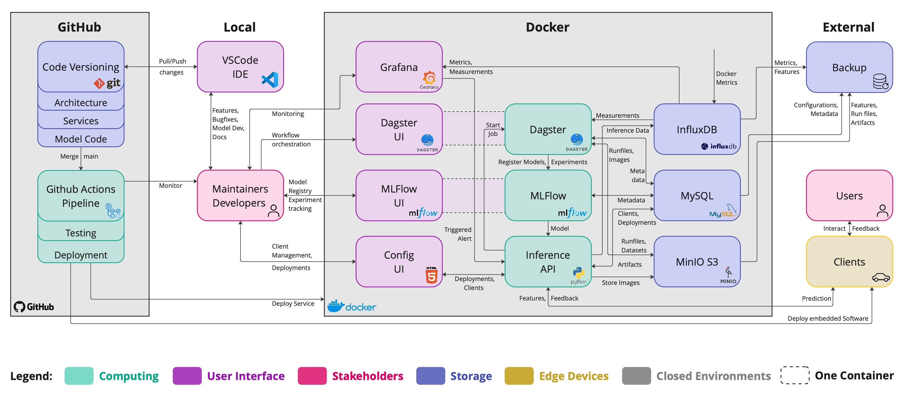

# Sandbox to implement MLOps practices

# THIS IS NOT UP TO DATE!

## Service overview

The environment consists of the following services:

- Mlflow, port 5003, manage experiments and models
- Grafana, port 3000, visualize inference data
- Minio, port 9000/9001, s3 object storage used by mlflow and dvc
- Mysql, port 3306, sql db used by mlflow
- Inference, port 5001, inference api to run model

## How to setup, start and stop the services

The services are hosted as docker containers using docker-compose.

- Make sure docker is up and running on your system
- Setup and start the services using `make setup_and_start_services`
- Stop the services using `make stop_services`
- Start the services using `make start_services

## How to backup and restore the docker volumes`

The service data is stored in volumes.

- Run `make backup_docker_volumes` to create a local backup in the folder `backup`
- Run `make restore_docker_volumes` to restore the volume from the backups

## How to manage datasets

- Datasets are stored in the folder datasets. THe version control is handled by dvc. The datasets will be synced to github, but stored at another remote (default: s3)
- To download the dataset files, run `make dvc_pull_s3`
- To upload a new dataset file or sync changes, run `make dvc_comit_push_s3` and commit changes to github

## How to deploy a model

- Your github token must be configured to allow repo and workflow access
- Run `make start_dev_deployment_workflow`to start the workflow (no protection rules)
- Run `make start_prod_deployment_workflow`to start the workflow (approval required, deployment is only allowed from `main`)
- Check the workflow status in github actions

### How to configure a new environment

- Open the environment configuration
- Click `New Environment`
- Enter a name (lower key preferred)
- Configure potection rules
- Set the environment secrets `AWS_ACCESS_KEY_ID` and `AWS_SECRET_ACCESS_KEY`
- Set the environment variables `ÀWS_DEFAULT_REGION` and `BUCKET_NAME` to configure the S3 connection

## Next development steps

- Save more artifacts
- Advanced model training code with multiple parameters
- Deploy to an automated testing environment and run tests there
- Deploy to target system
- Export the model
- Run tests with the compiles model and the implementation code
